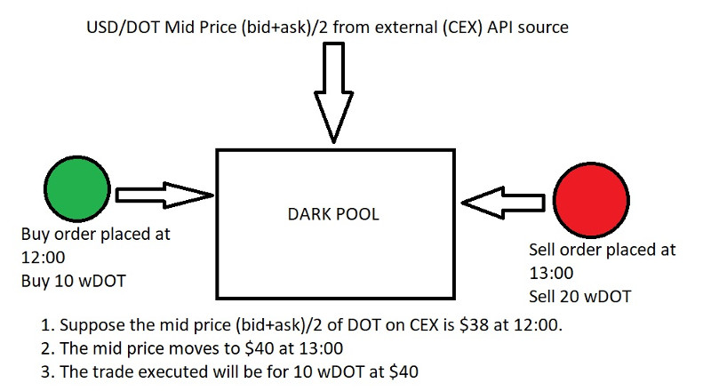

# Summary

The aim of the APAC Polka Hack Team is to build a proof-of-concept Darkpool Decentralized Exchange as a dApp/smart contract on top of Phala, a Polkadot parachain focusing on privacy smart contracts.

# History of Crypto Exchanges

The history of exchanges for crypto is as follows. The very first iteration of crypto exchanges are the **Centralized Exchanges** (e.g. MtGox, Bitstamp, Coinbase, Binance, etc). These exchanges were implemented as **Orderbook** Exchanges, the most intuitive (and probably the most robust) type of exchange, involving the familiar system of users leaving a list of buy/sell orders sorted in order of price, that mirrors how exchanges in traditional finance operate.

More information about orderbooks here: https://www.investopedia.com/terms/o/order-book.asp

The problem with the Centralized Exchange model is that centralization forced users to trust the owners of the exchange and made their funds vulnerable to hackers and malicious exchange owners. This led to the rise of the **Decentralized Exchange** model. The first iteration of decentralized exchanges naturally followed Orderbook Exchange model (eg IDEX), implemented as a dApp/smart contract in Solidity on top of Ethereum. However, these first generation orderbook DEXes faced a different problem, which is that as a smart contract, users/traders/marketmakers need to send their instructions as transactions to the smart contract, meaning they need to pay gas fees everytime they send/update/cancel orders. This is economically infeasible, especially for marketmakers who typically update their orders every second or even fraction of a second in response to market moves. The enormous gas fees that they would rack up would quickly kill any hopes of profits.

The next generation of DEXes introduced the **AMM (Automated Market Maker) model** (eg Uniswap, Sushiswap, etc). The AMM DEXes solved the transaction fee problem that plagued the Orderbook DEX, by getting rid of marketmakers and orderbooks and introducing the new concepts of “liquidity providers” and “constant product” pricing. However, AMM DEXes come with their own host of problems such as high slippage costs due to low liquidity and order frontrunning due to the public nature of pending transaction pools in blockchains like Ethereum.

More information about AMM DEXes here: https://www.youtube.com/watch?v=1PbZMudPP5E

# Darkpool DEX: What is it good for?

Before introducing the concept of a darkpool DEX, we look at a Polkadot parachain project called Phala. Phala utilizes a hybrid blockchain/hardware solution (called TEE, or Trusted Execution Environment) to guarantee privacy of smart contracts and transactions. As an added side benefit, since smart contract logic is executed natively inside the TEE, Phala smart contracts are able to make HTTP requests natively (as opposed to Ethereum smart contracts, which require oracles).

More information on Phala here: https://wiki.phala.network/en-us/docs/spec/

This allows the possibility for a darkpool exchange to be built on top of Phala as a dApp/smart contract. The darkpool exchange gives privacy guarantees that user orders and order sizes will be hidden from others. Why is this useful? When traders post their bid/offer limit orders on traditional orderbook exchanges, this “leaks information” to the general market. For example, if a whale wants to buy $1 million of Bitcoin, the price may likely move higher in anticipation when other participants see a big buy order, and the whale will get a worse executed price as a result. In contrast, in a darkpool exchange, the whale can be sure that no one is aware that they are intending to buy such a large quantity of coins.

# Darkpool DEX: Business Logic

In a Darkpool DEX, users will send only three pieces of information:

1) The **MARKET** they intend to interact with (eg DOTUSD, KSMUSD, ETHUSD, BTCUSD, etc)

2) The **SIDE** of their order (eg BUY or SELL. Note: The convention is BUY refers to buying the first symbol of a market pair, and SELL refers to selling the first symbol of a market pair. That is, “BUY DOTUSD” means the user intends to buy DOT and sell USD.)

3) The **SIZE** of their order (Note: the convention again is the SIZE refers to the size of the first symbol of a market pair. For example, “BUY 100 DOTUSD” means the user intends to buy 100 DOTs, or roughly $40,000 USD worth of DOTs (assuming 1 DOT = $40). )

Importantly, note that users do not send any indication of what price they intend to buy or sell at. When a buyer sends their order, they will enter a “bids” queue, sorted by FIFO (first in, first out).

Similarly, when a seller sends their order, they will enter an “asks” queue, sorted by FIFO.

A trade is executed when there is both an order in the “bids” queue and an order in the “asks” queue. The price at which the trade is executed will be determined by an external reference price, provided via HTTP request. Practically, what this means is the smart contract will request for the current price from one (or more) centralized orderbook exchanges, such as Coinbase, Kraken, Binance, etc. The HTTP request will return the best bid/best offer from these exchanges and the smart contract will calculate the **mid price**. Theoretically, this mid price represents the true value or fair value of the market pair at the current time. Finally, this mid price will be used as the execution price for the matched buy and sell order.

Once the trade details (market, price, size, etc) are finalized, the actual physical transfer of native chain tokens from the accounts of the matched buy and sell users is facilitated by Polkadot’s XCM protocol for crosschain messaging. Since XCM is still currently not well-documented yet, for the purposes of a rapidly-developed proof-of-concept, it is acceptable that as a first iteration, we simulate the token movement by a transfer of artificial ERC20-style tokens that we can hardcode into the darkpool smart contract.
